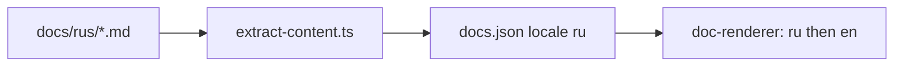

# План: русский UI для learn-claude-code (web) — обновление

## Текущая архитектура (без изменений)

См. предыдущую версию: локали в [`layout.tsx`](../web/src/app/[locale]/layout.tsx), сообщения в [`messages/*.json`](../web/src/i18n/messages), пайплайн [`extract-content.ts`](../web/scripts/extract-content.ts) → [`docs.json`](../web/src/data/generated/docs.json), тип [`DocContent`](../web/src/types/agent-data.ts), annotations в [`web/src/data/annotations/`](../web/src/data/annotations).

---

## Фаза 2 — как переиспользовать `docs/rus/`

**Факт:** в [`docs/rus/`](../docs/rus) уже лежат **9 файлов**, не **12** как в [`docs/en/`](../docs/en). Имена **не совпадают** с `en` (например `s01-kak-rabotaet-agent.md` вместо `s01-the-agent-loop.md`), но префикс **`sNN`** совпадает с тем, что ожидает `extractDocVersion` в `extract-content.ts` (регулярка `^(s\d+[a-c]?)-`).

| Покрытие             | Детали                                                                                                                                                                                                                                                                                                                                                                                          |
| -------------------- | ----------------------------------------------------------------------------------------------------------------------------------------------------------------------------------------------------------------------------------------------------------------------------------------------------------------------------------------------------------------------------------------------- |
| Два файла на **s01** | `s01-kak-rabotaet-agent.md`, `s01-kak-llm-zapuskaet-bash.md` — при текущей логике оба попадут в `docs.json` с одной парой `(version, locale)`; в [`doc-renderer`](../web/src/components/docs/doc-renderer.tsx) сработает **первое совпадение** (порядок обхода файлов). Нужно **слить в один** `s01-*.md` или оставить один файл и второй удалить/архивировать. |
| Два файла на **s02** | Аналогично: объединить в один `s02-*.md` под одну сессию.                                                                                                                                                                                                                                                                                                                                       |
| **s03–s07**          | По одному файлу — ок для пайплайна.                                                                                                                                                                                                                                                                                                                                                             |
| **s08–s12**          | В `rus` **нет** отдельных файлов — Tutorial для `/ru` будет **fallback на английский** (уже есть в `doc-renderer`), пока не добавите переводы.                                                                                                                                                                                                                                                  |

**Рекомендуемая стратегия (минимум дублирования):**

1. **Оставить контент в `docs/rus/`** (не копировать всё в новую `docs/ru/` без необходимости).
2. В **`extract-content.ts`**: добавить чтение каталога `rus` и записывать в `DocContent` с **`locale: "ru"`** (маршрут приложения остаётся `/ru` — это только имя папки vs код локали).
3. Расширить тип `DocContent.locale` и ветки `detectLocale` / массив локалей везде, где сейчас `en | zh | ja`.
4. **Перед `npm run extract`**: вручную **объединить** дубликаты s01 и s02 в по одному markdown на версию (или явно удалить лишний файл), чтобы не было недетерминизма.
5. Опционально: позже переименовать файлы в стиле `en` только для удобства сопоставления — **не обязательно** для работы скрипта.

---

## Оценка бюджета: токены и деньги

Цифры **очень грубые**: зависят от модели, глубины правок и того, делаете ли вы правки сами или через агента. Удобно считать в **миллионах токенов (MTok)** и умножать на ваш тариф (например, ориентир для типичного «агентного» сценария с Claude Sonnet 4: порядка **$3/MTok input** и **$15/MTok output** — итог сильно зависит от соотношения in/out).

| Фаза         | Содержание                                                                              | Порядок объёма работы                                       | Ориентир токенов (вся итерация: чтение репо + правки + проверка)     | Ориентир в USD (грубо, одна модель среднего класса) |
| ------------ | --------------------------------------------------------------------------------------- | ----------------------------------------------------------- | -------------------------------------------------------------------- | --------------------------------------------------- |
| **1**        | `ru.json`, wiring локали, `VERSION_META` / messages для подзаголовков, жёсткие строки   | Средний объём кода; `en.json` компактный (~80 строк ключей) | **~0,05–0,2 MTok**                                                   | **~$0,5–3**                                         |
| **2**        | `extract` + типы + слияние дубликатов s01/s02; **без** написания s08–s12 с нуля         | Низкий, если только пайплайн и правка папки `rus`           | **~0,02–0,08 MTok**                                                  | **~$0,2–1**                                         |
| **2+**       | Дополнительно: перевести **с нуля** недостающие сессии **s08–s12** по объёму как в `en` | Высокий объём текста                                        | **~0,15–0,4 MTok на сессию** (всего **~0,75–2 MTok** на пять сессий) | **~$5–25** в зависимости от модели и черновиков     |
| **3**        | `ru` во всех `decisions[]` в **s01–s12.json**                                           | Очень большой: сотни коротких полей                         | **~0,3–1 MTok+**                                                     | **~$3–20+**                                         |
| **4**        | Сценарии                                                                                | Средний                                                     | **~0,05–0,2 MTok**                                                   | **~$0,5–2**                                         |
| **5**        | Подписи визуализаций                                                                    | Низкий–средний                                              | **~0,02–0,1 MTok**                                                   | **~$0,2–1**                                         |
| **Проверка** | `npm run build`, ручной просмотр                                                        | Низкий                                                      | Уже внутри фаз                                                       | —                                                   |

**Итого «минимальный продукт»** (фазы 1 + 2 с переиспользованием `rus`, без полного перевода annotations и без s08–s12): ориентир **~0,1–0,35 MTok** и **~$1–5** на токены API при работе через ассистента.

**Итого «полный»** (+ annotations + пять недостающих tutorial-файлов): **~1–3+ MTok** и **~$10–50+** — порядок, не смета.

---

## Фазы 1, 3–5 и проверка (кратко, без изменения смысла)

- **Фаза 1** — как в исходном плане: `ru.json`, `ru` в роутинге и i18n, русские метаданные страницы версии, вынести хардкод.
- **Фаза 3** — ключи `ru` в annotations s01–s12.
- **Фазы 4–5** — опционально: scenarios, visualizations.
- **Проверка** — `npm run build`, смоук `/ru/...`.

---

## Зависимости

- В README указать поддержку `/ru` и что Tutorial на русском покрывает материалы из `docs/rus/` (и fallback на EN для остальных сессий, пока не переведено).
